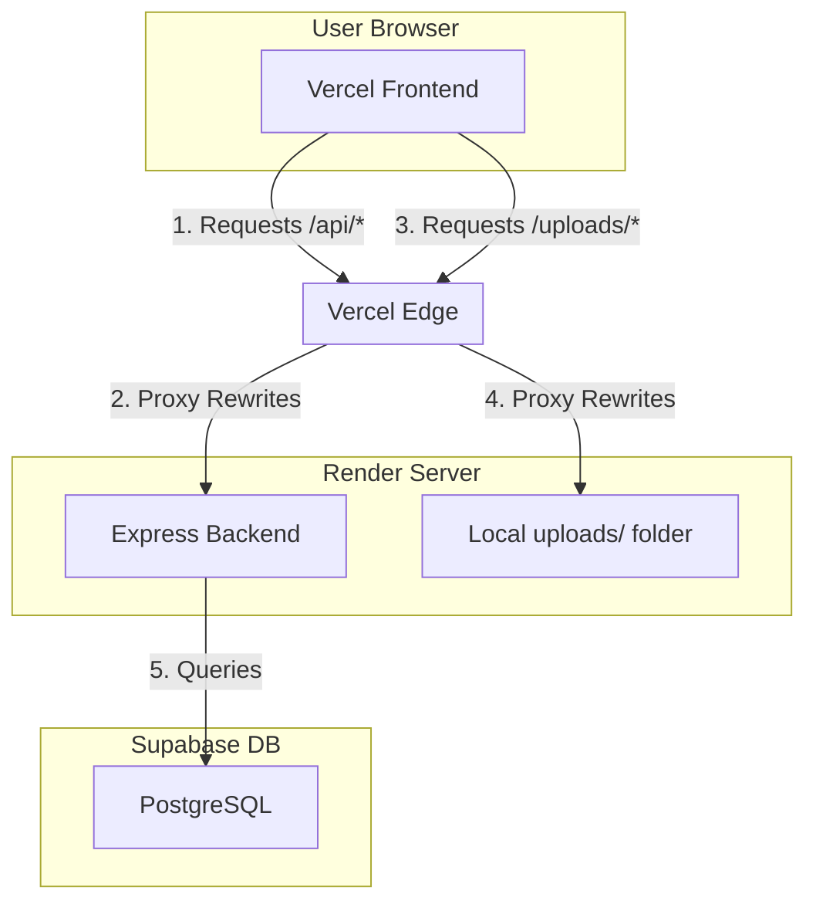

# Deployment Guide: Vercel (Frontend) & Render (Backend) & Supabase (Database)

This guide outlines the step-by-step process to deploy the **Blend & Bond Cafe** system using a split-hosting architecture:
1. **Frontend (React/Vite)**: Deployed on **Vercel** for lightning-fast edge delivery.
2. **Backend (Express)**: Deployed on **Render** (Web Service).
3. **Database (PostgreSQL)**: Deployed on **Supabase**.

---

## 🗺️ Split-Hosting Architecture



By using Vercel **Rewrites**, we route all client `/api` and `/uploads` requests directly to the Render server behind the scenes. This allows the client to keep using relative paths (e.g., `/api/products`) and completely avoids CORS errors in the browser.

---

## Step 1: Set Up the Database (Supabase)

1. **Create a Supabase Project**:
   - Log in to [Supabase](https://supabase.com/) and create a new project.
   - Note down your database password and the connection details.
2. **Execute SQL Schema**:
   - Go to the **SQL Editor** in Supabase and click **New query**.
   - Copy the contents of [supabase_schema.sql](file:///c:/Users/LENOVO%20IDEAPAD/blend-and-bond/supabase_schema.sql) and paste them here.
   - Click **Run**.
3. **Seed Database**:
   - Paste the contents of [supabase_seed.sql](file:///c:/Users/LENOVO%20IDEAPAD/blend-and-bond/supabase_seed.sql) into a new SQL Editor query and click **Run**.
   - This seeds the cafe settings, categories, products, and default accounts:
     - **Admin**: `jireh` / `faith`
     - **Staff**: `jai` / `212121`

---

## Step 2: Deploy Backend to Render

1. **Push Code to Git**: Ensure your code is pushed to your Git repository (GitHub/GitLab/Bitbucket).
2. **Create a Web Service on Render**:
   - Log in to [Render](https://render.com/) and click **New > Web Service**.
   - Connect your repository.
3. **Configure Settings**:
   - **Name**: `blend-and-bond-api`
   - **Environment/Runtime**: `Node`
   - **Build Command**: `npm install`
   - **Start Command**: `npm start`
   - **Note**: The backend only serves API routes and uploads. The frontend is deployed separately on Vercel.
4. **Configure Environment Variables**:
   - Go to the **Environment** tab and add:
     - `DB_HOST`: *Your Supabase Database Host*
     - `DB_USER`: `postgres`
     - `DB_PASSWORD`: *Your Supabase Database Password*
     - `DB_NAME`: `postgres`
     - `DB_PORT`: `5432`
     - `JWT_SECRET`: *A secure random string*
     - `PORT`: `5000` (or let Render assign it)
     - `NODE_ENV`: `production`
     - `CLIENT_URL`: `https://YOUR-PROJECT.vercel.app` *(The URL you get from Vercel in Step 3)*
5. **Deploy and Copy URL**:
   - Click **Deploy Web Service** and wait for it to build.
   - Copy the deployed API URL (e.g., `https://blend-and-bond-api.onrender.com`).

---

## Step 3: Configure and Deploy Frontend to Vercel

1. **Link the Backend in vercel.json**:
   - Open [vercel.json](file:///c:/Users/LENOVO%20IDEAPAD/blend-and-bond/vercel.json) in your workspace root.
   - Replace the default destination domains (`https://blend-and-bond-api.onrender.com`) with your actual Render URL:
     ```json
     {
       "cleanUrls": true,
       "trailingSlash": false,
       "rewrites": [
         {
           "source": "/api/:path*",
           "destination": "https://YOUR-RENDER-URL.onrender.com/api/:path*"
         },
         {
           "source": "/uploads/:path*",
           "destination": "https://YOUR-RENDER-URL.onrender.com/uploads/:path*"
         },
         {
           "source": "/:path*",
           "destination": "/index.html"
         }
       ]
     }
     ```
   - Commit and push this change to your repository.

2. **Create a Vercel Project**:
   - Go to [Vercel](https://vercel.com/) and click **Add New > Project**.
   - Import your Git repository.
3. **Configure Build Settings**:
   - **Framework Preset**: Select **Vite** (Vercel should auto-detect this).
   - **Root Directory**: `./`
   - **Build Command**: `npm run build`
   - **Output Directory**: `dist`
4. **Deploy**:
   - Click **Deploy**. Vercel will build the frontend and serve it at a `.vercel.app` URL.
5. **Update Render CORS**:
   - Copy your Vercel URL (e.g. `https://blend-and-bond.vercel.app`).
   - Go back to the Render dashboard for your Web Service.
   - Under **Environment**, update the `CLIENT_URL` variable to your Vercel URL.
   - Save changes. Render will automatically redeploy the backend with the correct CORS permissions.

---

## Step 4: Important Media Considerations (Uploads)

### Ephemeral Storage Warning
Since the frontend client uploads new product images to the backend running on Render, files are stored on Render's local disk in `/public/uploads/products`. 

Render's free tier uses **ephemeral disks**. When the server restarts (which happens at least once a day, or on code redeploys), any newly uploaded images will be **deleted**.

**Solutions**:
1. **Bundled Assets**: All standard menu images are pre-bundled in the git repository under `src/assets/images/` and dynamically mapped. They will never disappear.
2. **Persistent Disk (Render Paid Tier)**: Add a Render persistent volume/disk and mount it at `/opt/render/project/src/public/uploads` to preserve newly uploaded images.
3. **Cloud Media Storage (Advanced)**: Modify the backend product router to upload files directly to **Cloudinary** or **Supabase Storage**.
